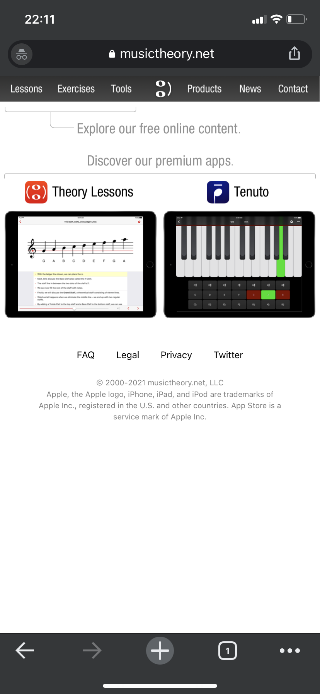

# ASSIGNMENT01: Heuristic Evaluation - CHRIS HUNT, DH110

## About this project.

Since COVID-19 Pandemic in 2020 temporarily closed schools in person teaching a lot of them moved to remote or online versions of their prior only physical product. This new category has a high demand with 5.1 million users in 2020 with a project CAGR (compound annual growth rate) of 17.7% and with a estimated market revenue of $130.7 million dollars in 2020 there's a ton of money up for grabs. I'm taking a look at two music learning/theory website/applications and seeing what I can learn from both in terms of good/bad UX choices and how I can improve the overall user experience in order for people to have a easier time using the products. The piano and guitar are the top 2 in market share and I chose 2 applications that cover both of those. One that will help with learning music theory to be applied to a multitude of music related things from learning to play the piano to singing. The other one is guitar based and requires a subscription past a certain amount of days to continue to access the information. I hope to show how we can improve the user's expeirence on both of these platforms in order to offer a great experience for each and every user.

## musictheory.net (Mobile Website)

https://www.musictheory.net

### Intro

This is a website where people can learn the basics of music theory. 

### Overall Evaluation

The musictheory.net (Mobile Website) is the Mobile version you see of musictheory.net when you access it from a phone. In my case I am accessing it from an iPhone 11 (non-pro). They also have a Desktop Version of the website which you can see when you access from a laptop or computer or a device with a big enough screen that the website will scale properly. The Mobile Website is missing a lot of usability that the Desktop Version has as well as some other things that both the Mobile and Desktop version can benefit from. The reason I am targeting the Mobile Website when they have an app avalible for the same thing is that the Websites are free on Mobile and Desktop they are free services anyone can use and take advantage of but the mobile app you have to pay money to access. So if someone wants to use musictheory.net on the Mobile device then they will realize very quickly that the Desktop Version is superior even with the many short comings. My goal is to make the Mobile Website of musictheory.net on par if not better than the Desktop Version because everyone has a phone with them at all times thus if they are able to use musictheory.net efficently free music theory lessons that are user friendly will be accessible at all times.

Heuristic & Description | musictheory.net Heuristic Evaluation | Improvement 
--------------------------|---------------------------|------------
**#1 Visibility of System Status**: The website/app gives users updates on what they are doing on the website/app. E.g. (Progress bar) | **Bad** The Website (not only mobile) doesn't show any progression stats. | **Improvement** Add some sort of progress bar within each lesson showing how many more activities you have to get through before you are done or just a empty bar that fills up a percentage based off how much you've completed of the lesson.
