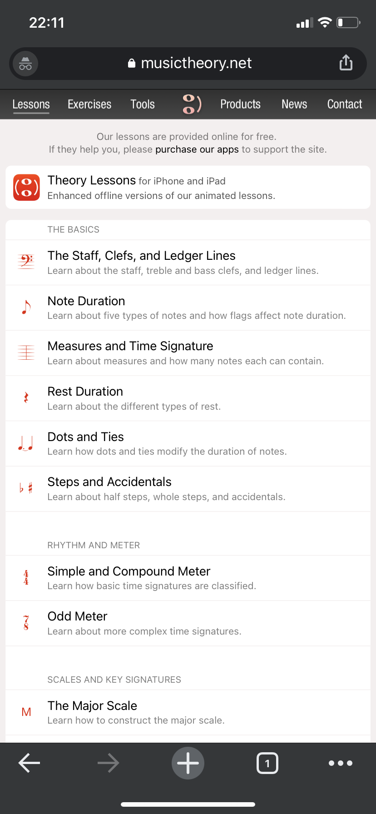
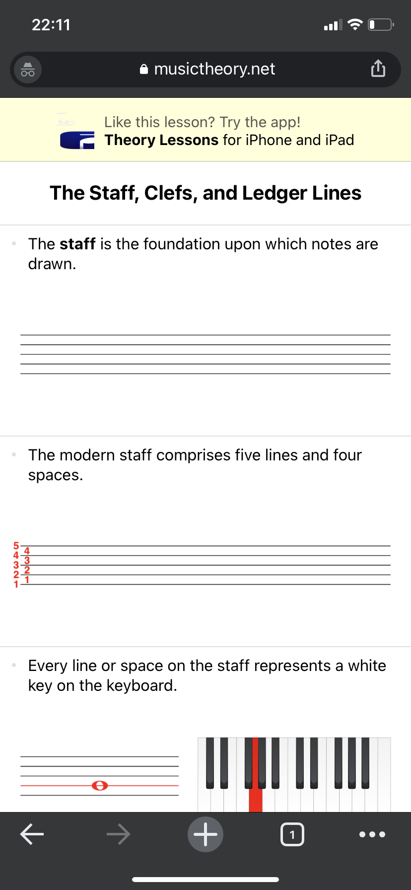

# ASSIGNMENT01: Heuristic Evaluation - CHRIS HUNT, DH110

## About this project.

Since COVID-19 Pandemic in 2020 temporarily closed schools in person teaching a lot of them moved to remote or online versions of their prior only physical product. This new category has a high demand with 5.1 million users in 2020 with a project CAGR (compound annual growth rate) of 17.7% and with a estimated market revenue of $130.7 million dollars in 2020 there's a ton of money up for grabs. I'm taking a look at two music learning/theory website/applications and seeing what I can learn from both in terms of good/bad UX choices and how I can improve the overall user experience in order for people to have a easier time using the products. The piano and guitar are the top 2 in market share and I chose 2 applications that cover both of those. One that will help with learning music theory to be applied to a multitude of music related things from learning to play the piano to singing. The other one is guitar based and requires a subscription past a certain amount of days to continue to access the information. I hope to show how we can improve the user's expeirence on both of these platforms in order to offer a great experience for each and every user.

## musictheory.net (Mobile Website)

https://www.musictheory.net

### Intro

This is a website where people can learn the basics of music theory. 

### Overall Evaluation

The musictheory.net (Mobile Website) is the Mobile version you see of musictheory.net when you access it from a phone. In my case I am accessing it from an iPhone 11 (non-pro). They also have a Desktop Version of the website which you can see when you access from a laptop or computer or a device with a big enough screen that the website will scale properly. The Mobile Website is missing a lot of usability that the Desktop Version has as well as some other things that both the Mobile and Desktop version can benefit from. The reason I am targeting the Mobile Website when they have an app avalible for the same thing is that the Websites are free on Mobile and Desktop they are free services anyone can use and take advantage of but the mobile app you have to pay money to access. So if someone wants to use musictheory.net on the Mobile device then they will realize very quickly that the Desktop Version is superior even with the many short comings. My goal is to make the Mobile Website of musictheory.net on par if not better than the Desktop Version because everyone has a phone with them at all times thus if they are able to use musictheory.net efficently free music theory lessons that are user friendly will be accessible at all times.

Heuristic & Description | musictheory.net Heuristic Evaluation | Improvement | Severity Rating 
--------------------------|---------------------------|------------|------------
**#1 Visibility of System Status**: The website/app gives users updates on what they are doing on the website/app. E.g. (Progress bar). | **Bad**: The Website (not only mobile) doesn't show any progression stats. | **Improvement**: Add a progress bar within each lesson showing how many more activities you have to get through before you are done or just a empty bar that fills up a percentage based off how much you've completed of the lesson. | 3 major usability problem.
**#2 Match between system and the real world**: The website/app uses language that the average user would understand. | **Good/Bad**: The Website (both Mobile and Desktop) use simple terminology in the home screen and throughout the Website in order to make it easy for users to navigate and find what they want. E.g. (Lessons, Exercises, Tools, Products, News, Contact). On the Desktop Version you are shown a Home Logo in the top left when you are inside a lesson and a lot of people may recognize that who are the younger crowd who have been surrounded by technology growning up but the older crowd or even maybe some younger folks may not realize right away what that means. | **Improvement**: Switch the Home Logo to a backwards button pointing backwards. | 2 important to fix.
**#3 User control and freedom**: The website/app provides a simple way to undo an action that may have been caused by mistake. | **Bad**: The Website (both Mobile and Desktop) do a terrible job in offering a way for users to go back or undo something. The mobile version is the worst offender because there is no back button located when you click on lessons and when you go into the lesson there is also no back button. On the Desktop Version you are shown a Home Logo in the top left when you are inside a lesson and a lot of people may recognize that who are the younger crowd who have been surrounded by technology growning up but the older crowd or even maybe some younger folks may not realize right away what that means. | **Improvement**: Add a back button to all pages (Mobile and Desktop) once you click past the homepage you are put on when you find this website. | 3 major usability problem.
**#4 Consistency and standards**: The website/app provide a consistent experience no matter what platform you are view/interacting with the website from. | **Bad**: The Mobile Website has a drastically different experience specifically the lessosns. On mobile when you click a lesson you don't have the same layout as Desktop. On the Desktop there's an Image of what you are learning about with text underneath it explaining what it is that you are looking at. You also have the option to move to the next topic in that section by using the arrow buttons at the bottom of the screen or the arrow buttons on your keyboard. On mobile you are shown a PDF essentially with the text now above the image and right below it the following text with the other image and so on. Unlike the Desktop where the image changes based off the text that is selected below the image. | **Improvement**: Add the ability to cycle through each part of the lessons on Mobile like it is on Desktop. Add a forward and backwards slide button on the bottom and present the info just like it is on Desktop just smaller (add support for horizonal view also). | 2 important to fix.
**#5 Error prevention**: The website/app stopping error prone conditions and if they are present make sure users are aware that the action may cause them to do something they don't intend to do and confirm that it is their true intention. | **Bad**: The Website (both Mobile and Desktop) don’t do a good job of preventing errors. When you are in a lesson and you click the home button or back arrow on your browser you’re immediately taken back to the prior webpage. Because the website has no way of saving your current progress you essentially have to start over and try and find where you were last and that could take precious time. | **Improvements**: Add a prompt that shows up when you click the home button or try to leave the current tab you are on going to another via the menu above the Lessons or using the keyboard or browser UI (e.g. back arrow or if you press ctrl + w to close it). The prompt should say “Looks like you’re trying to leave the page? None of the data will be saved. Are you sure you want to leave the page?”. | 2 Important to fix.
**#6 Recognition rather than recall**: The website/app putting stuff in the same place and making it perform the same action as it always has. | **Bad**:  The Website (both Mobile and Desktop) don’t do a good job of putting stuff in the same spots it was prior even though the space is available and it wouldn't hurt the UI of the webpage. When you are in a lesson on (both Mobile and Desktop) the header of the page that used to have the list of items (e.g. Lessons, Exercises, Tools, Products, News, Contact) is gone now users are expected to recognize the new symbol the home button to get you back to where you were before the lesson and see that header. | **Improvements**: Keep the header the same from the homepage and Lessons page when you are inside of the lessons instead of changing it to something completely new. You can also keep the current format by just inserting the header above it. | 2 Important to fix.
**#7 Flexibility and efficiency of use**: The website/app offers a tailored experience for different levels of users. | **Good**: The Website (both Mobile and Desktop) offer a really good experience for teachers in their ability to customize the exercises and thus send them to their students and have them do it. Being a free website I wasn’t expecting this level of customization but it’s a welcomed addition because it expands its target audience. | **Improvements**: No Improvements really needed. | 0 No need to consider changes to this as of now.
**#8 Aesthetic and minimalist design**: The website/app has information it needs and nothing else, especially stuff that isn’t relevant. | **Good**: The Website (both Mobile and Desktop) do a really good job of keeping a minimalist design. It’s clear what you’re looking for, not a lot of clutter on your screen, only what you need to know in order to find the right lesson for you. Lesson title and a little bit about what is included in the lesson underneath. | **Improvements**: No Improvements really needed. Would like to experiment with different layouts of the Lessons and see if others are also pleasing to the eye like this one or maybe design it so emphasis is placed on progress and leveling almost like a game. | 0 No priority really, just get to it if you have extra time to mess around with it.
**#9 Help users recognize, diagnose, and recover from errors**: The website/app tells the users what is going wrong so they can have an understanding of what needs to be fixed. | **Bad**: The Website (both Mobile and Desktop) don’t do a good job telling you what is missing when you are filling out a “contact us” form. There are 4 fields that need to be filled out (Your Name, Your email address, Subject and Message). If you fill out only 1, the highest order one will change from black text to red to indicate that you need to fill it out. | **Improvements**: Add something to prompt text to show up in red saying (missing name, email, subject, message) etc. | 2 Important to fix.
**#10 Help and documentation**: The website/app gives users information that might be helpful in completing some task on the website. | **Good/Bad**: The Website (both Mobile and Desktop) have a FAQ page. However, the FAQ is hidden at the bottom which needs the user to scroll very far to even see it. The FAQ also doesn’t have anything about lessons which would be helpful especially since it seems like they have a section for every other part of their site. | **Improvements**: Add FAQ to the top section where (Lessons, Exercises, Tools, Products, News, Contact) are currently. Add lessons section to FAQ because there’s a section in the FAQ for every other section except lessons. | 2 Important to fix

## Fender Play (Desktop Website)

https://www.fender.com/play/

### Intro

This is a website by Fender Guitars where people can learn how to play Acoustic Guitar, Electric Guitar, Bass, Ukulele.

### Overall Evaluation

The musictheory.net (Mobile Website) is the Mobile version you see of musictheory.net when you access it from a phone. In my case I am accessing it from an iPhone 11 (non-pro). They also have a Desktop Version of the website which you can see when you access from a laptop or computer or a device with a big enough screen that the website will scale properly. The Mobile Website is missing a lot of usability that the Desktop Version has as well as some other things that both the Mobile and Desktop version can benefit from. The reason I am targeting the Mobile Website when they have an app avalible for the same thing is that the Websites are free on Mobile and Desktop they are free services anyone can use and take advantage of but the mobile app you have to pay money to access. So if someone wants to use musictheory.net on the Mobile device then they will realize very quickly that the Desktop Version is superior even with the many short comings. My goal is to make the Mobile Website of musictheory.net on par if not better than the Desktop Version because everyone has a phone with them at all times thus if they are able to use musictheory.net efficently free music theory lessons that are user friendly will be accessible at all times.

Heuristic & Description | musictheory.net Heuristic Evaluation | Improvement | Severity Rating 
--------------------------|---------------------------|------------|------------
**#1 Visibility of System Status**: The website/app gives users updates on what they are doing on the website/app. E.g. (Progress bar). | **Good/Bad**: The website/app does a really good job with the progress of the lessons you are doing or have done. If you finished a lesson a percentage of the bar will fill up green equivalent to the proportion of lessons completed. However users have to know how many lessons they’ve completed to have an idea how much they have left. If you see the bar at 50% filled you may not remember how many hours it took you to complete the lessons to that point. | **Improvements**: Add some sort of “5/10 completed” or “50 mins of instruction remaining'' would help the user gauge how much time they have left to complete the 1 level. This wouldn’t be that hard given that each video is x amount of time so by just adding all the video time length together you will get a time for instruction of the entire level to complete. | 2 Important to fix.
**#2 Match between system and the real world**: The website/app uses language that the average user would understand. | **Bad**: The website/app does a terrible job with the Lessons or Levels naming them “Path” instead might throw some people off and send them towards another part of the website looking for Lessons or Levels. | **Improvements**: Changing from “Path” to Lessons or Levels might be valuable in looking into user experience and if there’s less confusion or a faster time to actually using the “Levels”. | 2 Important to fix.
**#3 User control and freedom**: The website/app provides a simple way to undo an action that may have been caused by mistake. | **Good**: The website/app does a really good job with this making it clear once you are in something how to go back. When you are inside a Level and presented with the Lessons to choose from it has a clear back button white text on a black background so it pops so if you managed to accidentally choose the wrong Level then you can go back. On mobile it doesn’t say “back” but has the back arrow white on a black background. | **Improvements**: No Improvements really needed. | 0 No need to consider changes to this as of now.
**#4 Consistency and standards**: The website/app provides a consistent experience no matter what platform you are viewing/interacting with the website from. | **Good**: The website/app looks identical to an untrained eye when you move from the desktop version to the app on your phone. The colors, layout, and all are found in the same spaces you would find them on the website while tailoring for a mobile experience with. | **Improvements**: No Improvements really needed. | 0 No need to consider changes to this as of now.
**#5 Error prevention**: The website/app stopping error prone conditions and if they are present make sure users are aware that the action may cause them to do something they don't intend to do and confirm that it is their true intention. | **Good**: The website/app does a good and bad job preventing errors. E.g. if you try to mark Level 1 as complete it pops up a new screen “Everything in this course will also be updated.” with a continue and cancel button. They also have a slider that says “Don’t show this message again” . Some people who are confident in the system will want the ability to mark things complete as they go and not get this notification/pop up confirming their actions. | **Improvements**: No Improvements really needed. However, they might want to consider looking into other applications that could use this as it's being implemented really well currently. | 0 No priority really, just get to it if you have extra time to mess around with it.
**#6 Recognition rather than recall**: The website/app putting stuff in the same place and making it perform the same action as it always has. | **Good/Bad**: The website/app does a good job putting stuff in the same spots on the app as it would be found on the desktop with some exceptions. On the desktop there's a menu on the side with (Home, My Path, Songs, Collections, Skills, Chord Challenge, Articles, Favorites, What’s New, Support, Tool Kit, My Account, and Sign Out). When we take a look at the app at the bottom we have (My Path, Songs, Skills, Collections, and More) under More there’s (Cord Challenge, Articles, Favorites, My Account, Practice Reminders). If you compared the two options where did (Home, What’s New, Support, Tool Kit, and Sign Out) go? It’s not like mobile users don’t need support or any of the other options. | **Improvements**: Add (Home, What’s New, Support, Tool Kit, and Sign Out) to the mobile application so if someone who normally uses the desktop version of Fender Play moves to the application they will be presented with the same menu albeit with a slightly different location on the screen. If they really want to you could also test the same layout on the desktop on the mobile app with a menu button and then the same exact menu that is show on the desktop variant would be show on mobile. | 3 Major usability problem.
**#7 Flexibility and efficiency of use**: The website/app offers a tailored experience for different levels of users. | **Good/Bad**: The website/app offers a wide variety of levels that people may be in their stage of learning guitar or the other instruments they offer. However, a placement test of some sorts would be very beneficial for users to possibly skip over stuff they already know or maybe go back further than they expected if they thought they knew something but it turns out that is not the case. | **Improvements**: Add a placement test of some sorts with the information covered in each level and see if users can test out of that level and start where they left off from the last time they were learning the guitar or other instruments. Adding an option when they sign up for the website/app “Already know some Guitar? Check your level here” Furthermore, possibly adding a test at the end of each level will help with reinforcement for users who aren’t necessarily taking the test to test out of the level with prior knowledge but learning this information for the first time. | 2 Important to fix.
**#8 Aesthetic and minimalist design**: The website/app has information it needs and nothing else, especially stuff that isn’t relevant. | **Good/Bad**: The website/app has excellent minimalist design and the use of color is not overwhelming for the eyes while also not being boring. However, the website doesn’t offer any text aids specifically in the videos. If someone has a hard time hearing or keeping up with the person who is talking in the video, closed captioning would help greatly for those who fall into those categories as well as those who do not. | **Improvements**: Add closed captioning to all the videos on the website. | 2 Important to fix.
